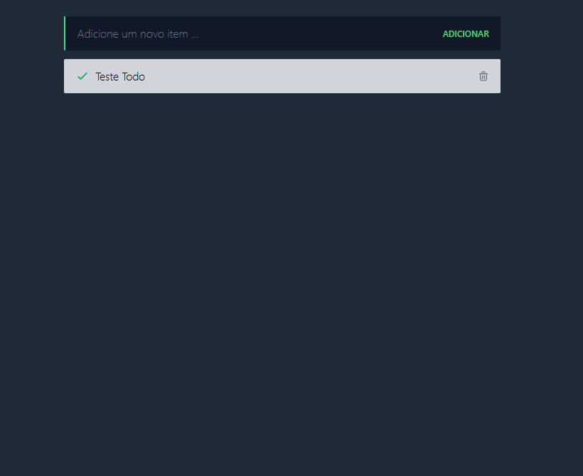

# 📝 Todo App - Vue.js 3 INTRO

Projeto desenvolvido durante o curso gratuito **Vue.js 3 INTRO** do [Tiago Matos](https://tiagomatos.com.br/), com foco nos fundamentos do Vue 3, utilizando a **Composition API**, além de práticas de gerenciamento de estado, consumo de APIs e componentização.

---

## 🚀 Tecnologias utilizadas

- [Vue.js 3](https://vuejs.org/) — utilizando a **Composition API**
- [Vuex](https://vuex.vuejs.org/) — Gerenciamento de estado
- [Axios](https://axios-http.com/) — Consumo de API
- [TailwindCSS](https://tailwindcss.com/) — Estilização
- [JSON Server](https://github.com/typicode/json-server) — API Fake REST

---

## 🔥 Funcionalidades

- ✅ Adicionar tarefas
- ✅ Listar tarefas
- ✅ Marcar como concluída
- ✅ Deletar tarefas
- ✅ Persistência local simulada com JSON Server

---

## ⚙️ Instalação e execução

```bash
# Clone o repositório
git clone https://github.com/seu-usuario/nome-do-repo.git

# Acesse a pasta
cd nome-do-repo

# Instale as dependências
npm install

# Inicie o JSON Server (API fake)
npx json-server --watch db.json

# Em outro terminal, execute o projeto Vue
npm run serve
```

---

## 💡 Aprendizados

- 📦 Organização de código com **Composition API**
- 🔗 Integração com APIs REST usando Axios
- ⚙️ Gerenciamento de estado global com Vuex
- 🎨 Criação de interface responsiva com TailwindCSS
- 🛠️ Boas práticas de componentização no Vue 3

---

## 🖼️ Preview



---

## 👨‍🏫 Créditos

Curso ministrado por [Tiago Matos](https://tiagomatos.com.br/) — **Vue.js 3 INTRO (Gratuito)**.

---

## 📝 Licença

Este projeto é apenas educacional e não possui licença específica.
